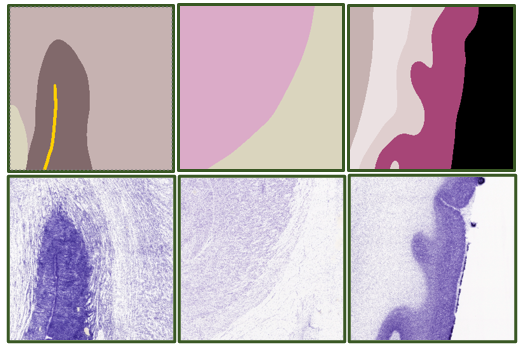
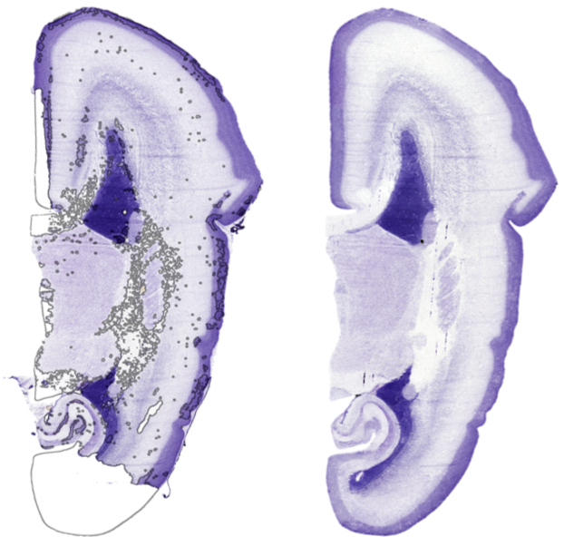
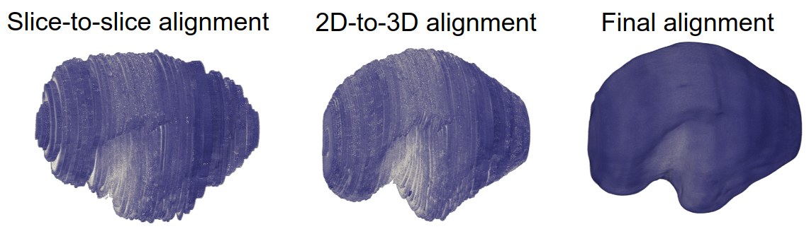

# &mu;Brain
#### A 3D volumetric reconstruction of the mid-gestation fetal brain  

see: [preprint link]

&mu;Brain a 3D digital atlas of the developing brain at micrometre scale based on a [public resource](https://www.brainspan.org/) of 81 serial histological sections of a prenatal human brain at 21 postconceptional weeks (PCW). Source data included serial coronal sections (20μm thickness) obtained from the right hemisphere of a single prenatal brain specimen, Nissl-stained, imaged at 1 micron resolution and labelled with detailed anatomical annotations.

## Code repository
### Image repair
To correct for tissue artefacts present in histological data, we designed an automated detect-and-repair pipeline for Nissl-stained sections based on *pix2pix*, a Generative Adversarial Network (GAN):

  

see: [**models.py**](/pix2pix/models.py) implementation of *pix2pix* models in [Keras](https://www.tensorflow.org/guide/keras)

We trained the pix2pix model on 1000 pairs of 256 × 256 image patches from (downsampled) 20μm resolution Nissl-stained sections and corresponding label annotations.

  

see: [**run_model_training.py**](/pix2pix/run_model_training.py)  code to run *pix2pix* training on a collection of paired image patches

To perform repair of whole sections, we split each label image into patches of 256 × 256 pixels with an 8 pixel overlap and passed them through the trained generator. The resulting, synthetic Nissl contrast patches were stitched together into a full section matching the dimensions of the original image

To detect regions of the original Nissl-stained section that needed repair, we designed an automated outlier detection method based on the Median Absolute Deviation (MAD) of pixel hue and saturation.

see: [**repair_atlas_images.py**](/repair_atlas_images.py)  code to perform image repair using a trained *pix2pix* model

  

### Volumetric reconstruction
Following automated repair of major tissue artefacts present in the histological data, we aimed to develop a 3-dimensional reconstruction of the fetal brain to facilitate comparison with *in vivo* MR imaging data.

Using the middle section as a reference, repaired Nissl-stained sections were aligned using a [graph-based, slice-to-slice registration](https://github.com/pmajka/poSSum). Pairwise rigid transforms were estimated between each section and its neighbouring sections in the direction of the reference. Dijkstra’s shortest-path algorithm was then used to calculate the set of transforms with lowest cost to align a given section to the reference. See also

see: [**initial_sequential alignment.py**](/initial_sequential_alignment.py) code to perform initial slice-to-slice alignment using a shortest-path algorithm

We used a population-based average anatomical image: the 22-week timepoint of the [Gholipour et al. spatio-temporal fetal MRI atlas](https://www.nature.com/articles/s41598-017-00525-w) as shape prior for 3D reconstruction. After matching MRI-based tissue labels to the μBrain tissue labels, we upsampled the MRI template to 50μm isotropic resolution and converted the MRI labels into an image Nissl-like contrast using the trained GAN model. Nissl-contrast images were re-stacked into a 3D volume to act as an anatomical prior for registration.

We performed an iterative affine registration procedure between the MRI-based shape prior and the 3D stack of histological sections. This process was repeated for a total 5 iterations, producing a final 3D volume with aligned coronal slices and a global shape approximately matched to the in utero fetal brain

see: [**align_2D_to_3D_reference.py**](/align_2D_to_3D_reference.py) code to perform 2D-to-3D affine registration

To create the final 3D volume, we employed a data augmentation technique, generating n=50 unique representations of the affinely-aligned data by applying nonlinear distortions along all three image axes. For each volume, we performed a weighted nonlinear registration between neighbouring sections to account for residual misalignments. Finally, to create a smooth 3D reconstructed volume, we co-registered all 50 augmented and aligned volumes into a single probabilistic anatomical template with voxel resolution 150 × 150 × 150μm using an iterative, whole-brain nonlinear registration

see: [**create_template.py**](/create_template.py) code for final nonlinear alignment

  

### Cortical surface extraction and registration
run_registration_1  
run_registration_2  
transfor_native to template

### Microarray data reprocessing
MicrorraData, reannotate
process_micrarray_data  

## Analysis
01-  
02-  
03-  
04-  
05-  
06-  

## References and related material
Ding, S.-L. et al. *Cellular resolution anatomical and molecular atlases for prenatal human brains.* J. Comp. Neurol. 530, 6–503 (2022).  

Miller, J. A. et al. *Transcriptional landscape of the prenatal human brain.* Nature 508, 199–206 (2014).  

Majka, P. & Wójcik, D. K. *Possum—A Framework for Three-Dimensional Reconstruction of Brain Images from Serial Sections.* Neuroinformatics 14, 265–278 (2016).  

Isola, P., Zhu, J.-Y., Zhou, T. & Efros, A. A. *Image-to-Image Translation with Conditional Adversarial Networks.* ArXiv161107004 Cs (2018).

Gholipour, A. et al. *A normative spatiotemporal MRI atlas of the fetal brain for automatic segmentation and analysis of early brain growth.* Sci. Rep. 7, 476 (2017).

Karolis, V. et al. *Developing Human Connectome Project spatio-temporal surface atlas of the fetal brain.* 300 MiB (2023) doi:10.12751/G-NODE.QJ5HS7.

Robinson, E. C. et al. *Multimodal surface matching with higher-order smoothness constraints.* NeuroImage 167, 453–465 (2018).
